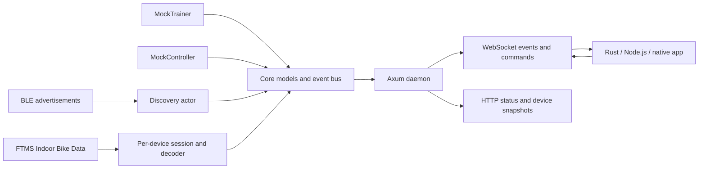

# BikeBridge

BikeBridge is a local API for smart trainers, cycling sensors, and bike controllers.
It handles Bluetooth and cycling protocols so your application doesn't have to.

**Smart trainer → BikeBridge → your app.**

This repository implements **Phases 1–4**: a native Rust daemon, normalized
models, mock trainer/controller, BLE discovery, FTMS telemetry and control,
and an HTTP/WebSocket API. Recorder/replay adds shareable `.biketrace` sessions. Physical trainer acceptance testing is still pending.
OpenBikeControl BLE inputs are implemented through the BikeControl bridge;
SDK packages are upcoming;
version `0.1.0` is a development version, not a claim that the complete v0.1
hardware acceptance criteria have been met.



## Quick start

Install the stable Rust toolchain and your platform's native compiler/linker
(on Windows, Visual Studio Build Tools with the C++ workload and Windows SDK).
Mock mode requires no Bluetooth adapter or hardware. Linux builds also require
`libdbus-1-dev` and `pkg-config`; see [platform setup](docs/devices.md).

From the repository root:

```sh
cargo run -p bikebridge-cli -- run --mock
```

The daemon listens at `http://127.0.0.1:9376` and `ws://127.0.0.1:9376/ws`.
Mock devices start connected with IDs `mock-trainer` and `mock-controller`.
Stop with Ctrl+C (or SIGTERM on Unix).

In another terminal:

```sh
cargo run -p bikebridge-cli -- status
cargo run -p bikebridge-cli -- devices
cargo run -p bikebridge-example
```

The Rust example subscribes, sets a 250 W target, injects a shift-up input, and
prints live events. On disconnect, its trainer control is released and reset.
Alternatively, with Node.js 22 or newer:

```sh
node examples/javascript/client.mjs
```

Use `cargo run -p bikebridge-cli -- --help` for CLI help.

## Discover real cycling devices

```sh
cargo run -p bikebridge-cli -- run
```

This enumerates Bluetooth adapters and scans on the first powered-on radio.
Use `run --no-auto-scan` to wait for an explicit scan command, or
`run --adapter-index 1` to select a different radio by its zero-based enumeration
index. In another terminal:

```sh
cargo run -p bikebridge-cli -- adapters
cargo run -p bikebridge-cli -- scan
cargo run -p bikebridge-cli -- devices
cargo run -p bikebridge-cli -- scan --stop
```

`scan` starts a continuous, process-wide scan and returns immediately; it does not
launch a second daemon. Give sensors time to advertise, then run `devices`.
`scan --stop` stops scanning without erasing discovered records. Both operations
are idempotent. In mock mode, scanning reports `bluetooth_unavailable`.

Detects advertised Fitness Machine, Cycling Power, Heart Rate, and Cycling
Speed/Cadence services. Results appear in `/api/devices` and as `device.discovered`
or `device.updated` events. Subscribe to `device` and `scan` for discovery updates:

```json
{"type":"subscribe","events":["device","scan","error"]}
```

The [Node discovery example](examples/javascript/discover.mjs) starts scanning and
prints snapshots and events: `node examples/javascript/discover.mjs`.

Advertisements indicate a provisional role; capability lists stay empty until
GATT features are verified on connection. No nearby device is automatically connected.
A missing or powered-off adapter is
reported in `/api/status` under `scan.lastError`; the API stays available.

## Receive real trainer telemetry

Wake the trainer, run the daemon, and copy its `ble-…` ID from `bikebridge devices`.
With Node.js 22 or newer, this example subscribes, connects, and prints watts/RPM/km/h:

```sh
node examples/javascript/trainer.mjs ble-<your-device-id>
```

Or connect using the CLI and subscribe from your own WebSocket client:

```sh
cargo run -p bikebridge-cli -- connect ble-<your-device-id>
cargo run -p bikebridge-cli -- disconnect ble-<your-device-id>
```

Connection discovers FTMS services, reads Fitness Machine Feature, and subscribes
to Indoor Bike Data. Power, cadence, speed, and available heart rate, distance,
average power, and elapsed time are delivered as normalized `telemetry` events.
Missing measurements are omitted. Split records are assembled without reusing
old values. See [FTMS decoding and limitations](docs/ftms.md).

BLE sessions are process-wide: closing a viewer or stopping discovery leaves a
connected trainer available to other clients. Explicit disconnect, link loss,
or daemon shutdown ends the session. Reconnect explicitly after a lost link, or
enable `[trainer].auto_reconnect` for bounded retries without restoring targets.

## Control a trainer

```sh
node examples/javascript/control.mjs ble-<your-device-id>
# Or mock-trainer when the daemon runs in --mock mode.
```

The interactive client connects and requests control. Enter `start`,
`resistance 0.1`, `erg 150`, `grade 2`, `stop`, `reset`, or `quit`. Commands require
the corresponding verified capability. Closing the owner attempts Stop/Reset
and disconnects its BLE trainer. See [FTMS control](docs/ftms-control.md) for
acknowledgements, range mapping, smoothing, and physical validation limits.

## Zwift, Shimano Di2, and SRAM AXS inputs

Pair supported Click/Play/Ride, Di2, or AXS controllers in BikeControl on a phone
or second computer. Select
**OpenBikeControl Compatible** and enable **Connect using Bluetooth**. BikeBridge
receives that BLE bridge:

```sh
bikebridge run --record controllers.biketrace
# In another terminal, find the BikeControl bridge ID:
bikebridge devices
node examples/javascript/controller.mjs ble-<bridge-id>
```

Shifting, steering buttons, confirm/back, brake values, and other mapped actions
become normal `input` events and can be recorded/replayed. Link loss releases held
inputs and attempts bounded reconnection. This requires BikeControl; proprietary
Zwift, Di2, and AXS pairing is not implemented inside BikeBridge. Physical controller
validation is pending. See [bridge setup](docs/zwift-controllers.md) and
[Di2 / AXS setup and synthetic replay demos](docs/di2-axs.md). Di2 uses D-Fly channel
assignments; AXS uses BikeControl 6.3+ and its button setup/restore flow.

## Record and replay a bug

Capture telemetry, shifting/input events, trainer commands and outcomes, and
disconnects, then reproduce the API timeline without hardware:

```sh
bikebridge run --record kickr-core-click-v2.biketrace
# Stop with Ctrl+C to finalize. Add --mock to record without hardware.
bikebridge trace-info kickr-core-click-v2.biketrace
bikebridge replay kickr-core-click-v2.biketrace --speed 1
```

Replay starts paused. Connect your app and subscribe, then use
`bikebridge replay-control start`. `pause` freezes time; `restart` rewinds.
Recorded commands are events, never hardware writes. Existing files are not
overwritten and incomplete traces are rejected. Try the included mock trace:

```sh
bikebridge replay examples/traces/demo-ride.biketrace
node examples/javascript/replay.mjs
```

See [Recorder / Replay](docs/recorder-replay.md) for the format, timing, HTTP
controls, and the distinction between API-event replay and BLE emulation.

## Build a native executable

```sh
cargo build --release --locked -p bikebridge-cli
```

Windows: `target/release/bikebridge.exe`; Linux/macOS: `target/release/bikebridge`.
The executable does not require a Rust installation on the destination machine.
Native system runtime requirements still apply. This phase does not install a
service, tray application, or auto-start entry.

```powershell
.\target\release\bikebridge.exe run --mock
.\target\release\bikebridge.exe status
```

## WebSocket example

The server first sends:

```json
{"type":"hello","protocolVersion":1,"bikeBridgeVersion":"0.1.0"}
```

Subscribe explicitly (sessions initially receive no device events):

```json
{"type":"subscribe","requestId":"sub-1","events":["telemetry","input","device"]}
```

In mock mode, set an ERG target:

```json
{"type":"trainer.setTargetPower","requestId":"erg-1","deviceId":"mock-trainer","data":{"watts":250}}
```

```json
{"type":"response","requestId":"erg-1","success":true,"data":{"applied":{"operation":"set_target_power","value":250}}}
```

```json
{"type":"telemetry","deviceId":"mock-trainer","data":{"powerWatts":250,"cadenceRpm":88.5,"speedKph":30.2,"heartRateBpm":142,"distanceMeters":120.0,"resistanceLevel":0.0,"timestampMs":1789776000000}}
```

Inject a controller input from the same connection:

```json
{"type":"mock.input","requestId":"shift-1","deviceId":"mock-controller","data":{"input":"shift_up","state":"pressed"}}
```

See [the complete protocol](docs/protocol.md) for subscriptions, connection commands,
measurement overrides, limits, error codes, and control ownership.

## Simple JavaScript / TypeScript transport example

The Phase 1 client uses Node's native WebSocket. A packaged TypeScript SDK with
typed event handlers is planned for Phase 7.

```javascript
const bike = new WebSocket("ws://127.0.0.1:9376/ws");
bike.addEventListener("open", () => {
  bike.send(JSON.stringify({ type: "subscribe", events: ["telemetry"] }));
});
bike.addEventListener("message", ({ data }) => {
  const event = JSON.parse(data);
  if (event.type === "telemetry") console.log(event.data.powerWatts, "W");
});
```

The [runnable JavaScript example](examples/javascript/client.mjs) also demonstrates
control, input injection, error reporting, and disconnect.

## C# and Unity

C# and Unity SDKs and their runnable examples are explicitly deferred to Phase 7.
There is no `BikeBridgeClient` library to install yet. Native applications can
consume protocol version 1 directly using a WebSocket library. The planned Unity
package will build on the transport-only C# SDK and dispatch events onto the Unity
main thread. No Unity game or editor automation is included.

## Configuration and safety

Copy `bikebridge.example.toml` to `bikebridge.toml`, or pass `--config path.toml`.
CLI `--host`, `--port`, and `--log-level` override file values.
`[bluetooth].auto_scan` defaults to true; `run --no-auto-scan` disables startup
scanning. `run --adapter-index` overrides `[bluetooth].adapter_index`.

```sh
cargo run -p bikebridge-cli -- run --mock --port 9380 --log-level debug
```

Commands clamp ERG power (default 800 W), absolute grade (15%), and normalized
resistance (0.7). Non-finite values and malformed messages are rejected.
Resistance transitions are smoothed at 0.2 units/second by default; resets remove
mock load immediately. BLE commands use advertised ranges and supported increments.
Responses report quantized targets; a smoothed resistance target completes asynchronously.

The first successful control command acquires session ownership. Other clients
can observe telemetry but cannot change that trainer until its owner resets or
disconnects. Owner disconnect, control execution failure, device disconnect, and
daemon shutdown clear simulated load and attempt acknowledged Stop/Reset on a
synchronized BLE channel before disconnecting. Lost links or uncertain transactions
can prevent cleanup writes. Physical fail-safe behavior remains unverified. Idle
broken WebSockets are detected by ping/pong. Optional automatic trainer reconnection
retries up to five times and never restores ownership or previous load targets.

Only loopback addresses are supported. Browser `Origin` headers are rejected,
including WebSocket upgrades; use native clients or Node.js. No CORS is enabled,
and loopback Host headers are required. Local processes are trusted;
there is no authentication or remote-access mode.

## Project layout

```text
.
├── Cargo.toml / Cargo.lock / rust-toolchain.toml
├── README.md / LICENSE / bikebridge.example.toml
├── crates/
│   ├── bikebridge-core/src/
│   │   ├── lib.rs / device.rs / discovery.rs / telemetry.rs / input.rs
│   │   └── command.rs / trainer.rs / event.rs / error.rs
│   ├── bikebridge-openbikecontrol/src/lib.rs / protocol.rs / connection.rs
│   ├── bikebridge-trace/src/lib.rs / recording.rs / playback.rs
│   ├── bikebridge-mock/src/lib.rs
│   ├── bikebridge-ble/
│   │   ├── src/lib.rs / backend.rs / classification.rs / registry.rs / scanner.rs
│   │   ├── src/transport.rs / connection.rs / session.rs / control.rs / ftms.rs
│   │   └── tests/discovery.rs
│   ├── bikebridge-server/
│   │   ├── src/lib.rs / state.rs / protocol.rs / websocket.rs / api.rs
│   │   └── tests/mock_api.rs
│   └── bikebridge-cli/src/main.rs / config.rs
├── examples/
│   ├── rust-console/Cargo.toml / src/main.rs
│   └── javascript/client.mjs / discover.mjs / trainer.mjs / control.mjs / replay.mjs / controller.mjs
├── docs/architecture.md / protocol.md / devices.md / ftms.md / ftms-control.md
│   / recorder-replay.md / zwift-controllers.md / di2-axs.md
└── .github/workflows/ci.yml
```

`core` defines the hardware-independent contract. `mock` implements the trainer
trait and input generation. `server` owns devices and session control, fans out
events through Tokio's bounded broadcast channel, and exposes Axum endpoints.
`cli` loads configuration, starts the daemon, and handles process signals.
`ble` owns platform handles and serializes discovery operations in a separate task,
so Bluetooth waits never hold the mock-device or API state locks.
See [architecture](docs/architecture.md) for boundaries and lifecycle details.

## Tests and CI

```sh
cargo fmt --all -- --check
cargo clippy --workspace --all-targets --locked -- -D warnings
cargo test --workspace --locked
cargo build --release --workspace --locked
```

Tests cover model serialization, command validation and clamping, mock behavior,
configuration, real loopback HTTP/WebSocket connections, event filtering, ERG
commands, controller inputs, abrupt disconnect cleanup, and shutdown. Tests use
ephemeral ports and require no Bluetooth hardware or running external daemon.
Discovery tests inject a backend and cover service classification, opaque identity,
partial advertisements, adapter selection, timeouts, scan failure/retry, scan
cleanup, and real HTTP/WebSocket delivery of discovery events.
FTMS tests cover all 8,192 flag combinations, truncated packets, signed fields,
record assembly, setup deadlines, link loss, cancellation, teardown failures,
manual reconnection, and encoded measurements delivered through real WebSockets.
Control tests cover encoding, capability/range checks, ownership, clamping, ramps,
acknowledgements, cancellation, cleanup, and bounded reconnects. Recorder/replay
tests verify ordering, timestamps, file validation, and WebSocket equivalence.
Controller tests cover rapid edges, partial updates, disconnect releases, retries,
and the path from injected notification bytes to WebSocket, recording, and replay.

GitHub Actions runs these checks on Windows, Ubuntu, and macOS and uploads native
daemon artifacts. The workflow must be run in a GitHub repository to validate those
platforms; adding it is not evidence that all platforms have passed.

## Platform and device support

| Platform | Current status |
| --- | --- |
| Windows x64 | Built and tested locally with stable Rust/MSVC |
| Linux / macOS | Portable code; native CI jobs configured, not locally verified |
| Windows ARM64 / Linux ARM64 / macOS x64 | Architecture targets; dedicated release jobs and verification pending |

Real BLE discovery and MockTrainer/MockController are implemented. The mock trainer
includes a simulated heart-rate field; a standalone MockHeartRateMonitor is deferred.
FTMS telemetry/control and OpenBikeControl bridge inputs are implemented; physical
trainer and controller validation remains pending. See [devices](docs/devices.md).

## Roadmap

1. **Phase 1 — implemented:** native mock daemon, normalized models, events, HTTP,
   WebSocket, example clients, tests, and CI definition.
2. **Phase 2 — implemented:** isolated `bikebridge-ble`, adapter discovery, scan
   start/stop, advertised-service classification, opaque session identities,
   discovery events, HTTP scan operations, and CLI integration.
3. **Phase 3 — implemented, hardware validation pending:** Bluetooth SIG FTMS parsers,
   explicit connections, subscriptions, telemetry, and disconnect cleanup.
4. **Phase 4 — implemented, hardware validation pending:** advertised feature/range checks, FTMS control-point transactions,
   device-specific safety mapping, disconnect handling, and bounded reconnection.
5. **Phase 5:** heart rate, power, and CSC sensors, rollover tests, preferred roles,
   and lightweight persistence.
6. **Phase 6 — BLE bridge implemented, hardware validation pending:** OpenBikeControl
   input via BikeControl, connection lifecycle, normalized events, and recorder/replay.
   Network transport and direct proprietary pairing are deferred.
7. **Phase 7:** C#, TypeScript, and Unity SDKs and examples; expand native packaging.

No cloud service, GUI, proprietary protocol, ANT+, or game is included.

## License

MIT. See [LICENSE](LICENSE).
